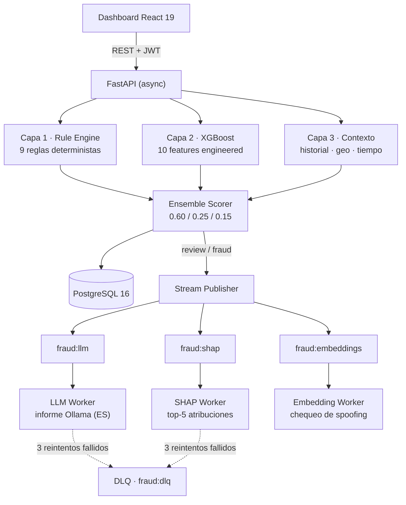

# 🛡️ Fraud Detector Hybrid

[](https://github.com/mikelrh-dev/fraud-detector/actions/workflows/ci.yml)

[English](README.md) | **Español**

> 📖 **Lee el [caso de estudio técnico](case-study/es/index.html)** — un recorrido en 11 capítulos de cómo funciona este sistema, cada número trazado a un artefacto real.
>
> 🧭 **Wiki técnica:** consulta la [wiki para desarrolladores](docs/wiki/index.md), con el modelo del sistema, arquitectura, scoring, workers, ML y operación.

Sistema híbrido de detección de fraude en transacciones financieras. Un **motor de reglas determinista** (9 reglas), un **modelo ML supervisado** (XGBoost) y un **LLM local** (Ollama) que redacta informes explicativos para analistas — el LLM nunca decide, solo explica.

> **Sobre el modelo ML, sin rodeos:** está entrenado sobre un **corpus sintético** de arquetipos de fraude generado en este repositorio — no con PaySim, ni con datos bancarios. Las reglas deciden; la capa ML aporta un 25% calibrado. Las cifras medidas y los límites conocidos están en [Qué hace el modelo y qué no](#qué-hace-el-modelo-y-qué-no).

Cada transacción recibe un score de riesgo 0–100, una clasificación (`legitimate | review | fraud`), atribuciones SHAP de sus features y, cuando se marca como sospechosa, un informe técnico generado asíncronamente por el LLM.

## Características destacadas

- **Scoring ensemble de 3 capas**: reglas 60% + ML 25% + contexto 15%, con umbrales de fraude dinámicos por tier de monto
- **9 reglas deterministas**: importe, velocidad, riesgo de merchant, card mismatch, patrones nocturnos, country mismatch y proximidad a redes de fraude
- **XGBoost** con 10 features engineered (5 de las cuales aportan señal medible — ver la ablación), degradación elegante (el sistema funciona con `ml_score = 0` si no hay modelo)
- **Explicabilidad SHAP**: top-5 contribuciones de features persistidas por transacción
- **Detección de redes de fraude**: grafo dirigido (NetworkX), marca usuarios a ≤ 2 saltos de un defraudador conocido
- **Detección de suplantación de merchant**: embeddings sentence-transformers + similitud coseno (detecta `AMAZ0N_STORE` → `Amazon`)
- **Redis Streams** con consumer groups, recuperación de mensajes pendientes (`XAUTOCLAIM`) y dead-letter queue
- **Monitoreo del modelo**: drift con Evidently + PSI propio, triggers automáticos de reentrenamiento (F1 < 0.7 o drift > 30) — implementados, aún no ejercitados contra una referencia poblada
- **Audit trail inmutable** con checksums SHA-256 en cada decisión de scoring y acción de analista
- **Auth JWT** (access + refresh + blacklist), acceso por roles (user/admin), rate limiting por ruta
- **Dashboard React 19** con tendencias de score, tarjetas SHAP y flujo de trabajo de alertas
- **846 tests de backend** (unitarios + integración) y 746 tests de frontend, CI con 5 jobs (ruff, mypy, pytest, ESLint, vitest, build smoke de Docker)

## Arquitectura



**Stack:** Python 3.11 · FastAPI · PostgreSQL 16 (asyncpg) · Redis 7 (Streams) · XGBoost · SHAP · NetworkX · sentence-transformers · Evidently · Ollama · React 19 + TypeScript + Vite + Tailwind 4 · Docker Compose (8 servicios)

## Cómo se puntúa una transacción

```
risk_score = 0.60 × rule_score + 0.25 × ml_score + 0.15 × context_score
```

La clasificación se compara contra un umbral dinámico que se endurece con montos mayores:

| Tier de monto | Umbral de fraude |
|---|---|
| $0 – $1,000 | ≥ 70 |
| $1,001 – $10,000 | ≥ 50 |
| $10,001 – $50,000 | ≥ 45 |
| $50,001+ | ≥ 40 |

La banda `review` arranca al 75% del umbral del tier. Por debajo, la transacción es `legitimate`.

### Capa 1 — Motor de Reglas (determinista, tope 100)

| Regla | Peso | Disparador |
|---|---|---|
| `high_amount` | 35 | importe > $1,000 |
| `velocity_burst` | 30 | > 1 txn en 5 min en categoría de riesgo |
| `high_velocity` | 25 | > 3 txns en 5 minutos |
| `off_hours_crypto` | 25 | horario nocturno (0–6) + categoría de riesgo |
| `unusual_merchant` | 20 | merchant en blacklist o categoría de riesgo |
| `card_mismatch` | 20 | tarjeta fuera de las conocidas del usuario |
| `country_mismatch` | 15 | país de la txn ≠ país del usuario |
| `near_fraud` | 15 | usuario a ≤ 2 saltos de un defraudador (grafo) |
| `unusual_hours` | 10 | txn entre 00:00–06:00 |

Categorías de riesgo: `btc`, `crypto`, `gambling`, `casino`, `money_transfer`.

### Capa 2 — Modelo ML (XGBoost)

10 features: `amount`, `amount_vs_user_avg`, `amount_vs_user_std`, `tx_count_last_5min`, `tx_count_last_1h`, `hour_of_day`, `is_weekend`, `merchant_risk_level`, `is_crypto`, `amount_round_number`.

La salida de `predict_proba` se escala directamente a 0–100 (`probability * 100.0`) y se calibra con `CalibratedClassifierCV(method="sigmoid", cv=5)` contra la prevalencia real del 0,96% del corpus — de modo que la puntuación es una probabilidad contra esa tasa base, no un margen bruto. Si no hay archivo de modelo, la API sigue funcionando con `ml_score = 0`.

### Capa 3 — Contexto

Señales a nivel de usuario (velocidad de transacciones recientes) aportan el 15% restante, calculadas en `scoring_service.py` como `min(recent_txns / 10 × 100, 100)` y pasadas explícitamente al ensemble.

### Qué hace el modelo y qué no

Medido, no afirmado. Reproducible con `python scripts/evaluate_model.py`.

| | |
|---|---|
| ROC-AUC / PR-AUC en test retenido | 0,9312 / 0,7576 |
| En el umbral de producción | precisión 0,817 · recall 0,698 |
| Falsos positivos | 15 de 9.904 legítimos |
| Error de calibración (ECE) | 0,0045 |
| Ganancia frente a una línea base de random forest | +0,025 ROC-AUC |

Es un clasificador real con poder discriminativo real, y está acotado. Cuatro límites que medimos en lugar de ocultar:

1. **Los datos de entrenamiento son sintéticos.** Nunca hubo datos bancarios disponibles, así que el corpus se genera a partir de arquetipos de fraude (`everyday`, `burst`, `high_value_wire`, `card_testing`, …) diseñados para ser difíciles a propósito.
2. **No transfiere a PaySim.** Evaluado contra ese benchmark publicado e independiente a través del mismo `FeatureEngine`, alcanza un ROC-AUC de 0,7561 — *por debajo* del 0,7894 de una línea base de importe bruto. PaySim tiene un usuario por transacción, lo que degenera 4 de las 10 features, y un rango de importes 92× más amplio que el del corpus de entrenamiento.
3. **Dos features soportan casi todo.** Caída de ROC-AUC leave-one-out: `tx_count_last_1h` +0,059, `tx_count_last_5min` +0,029, `merchant_risk_level` +0,021, `amount` +0,020 — mientras que `is_weekend` (+0,0004) e `is_crypto` (−0,0005) no aportan nada.
4. **El recall es 0,698 en el umbral actual.** Aproximadamente 3 de cada 10 fraudes no se marcan en ese punto de operación; el umbral es una compensación de costes, no un parámetro libre.

## Explicabilidad, Monitoreo y Auditoría

- **SHAP** (`TreeExplainer` sobre XGBoost): top-5 atribuciones calculadas async por transacción puntuada, visualizadas en el dashboard.
- **Detección de drift**: Evidently `DataDriftPreset` (distribuciones referencia vs actual) más una implementación PSI propia. `GET /api/v1/monitoring/drift`.
- **Triggers de reentrenamiento**: se activan con `F1 < 0.7` o `drift_score > 30` (verificado en `MonitoringService`). La lógica está viva; la referencia de drift contra la que se compara nunca se ha poblado con una ventana completa, y ahora se niega a sembrarse con menos de 200 filas.
- **Audit trail**: cada score, revisión de analista e informe LLM se registra con checksums SHA-256. La exportación de actividad de analistas es solo admin.

## Workers Asíncronos (Redis Streams)

| Stream | Consumer group | Worker | Salida | Política de reintento |
|---|---|---|---|---|
| `fraud:llm` | `llm-workers` | `llm_worker` | fila `LLMReport` + entrada de auditoría | queda PENDING, máx. 3 |
| `fraud:shap` | `shap-workers` | `shap_worker` | filas `ShapAttribution` (top 5) | 3 reintentos → DLQ |
| `fraud:embeddings` | `embedding-workers` | `embedding_worker` | clave Redis con resultado (TTL 1h) | ack al success, log al fallo |

Los streams se recortan (`MAXLEN ~ 100,000`). La DLQ (`fraud:dlq`, tope 10K) guarda el stream original, el consumer group y el motivo del error. Un loop de recuperación reclama mensajes pendientes idle cada 60s vía `XAUTOCLAIM` (timeout de 5 min).

## Quick Start

### Con Docker (recomendado)

```bash
git clone https://github.com/mikelrh-dev/fraud-detector.git
cd fraud-detector
cp .env.example .env

docker compose up -d                                # 8 servicios: postgres, redis, ollama, api, 3 workers, frontend
docker compose exec ollama ollama pull qwen2.5:0.5b # LLM por defecto (configurable vía OLLAMA_MODEL)
docker compose exec api python scripts/init_db.py   # crear tablas

# Docs API:   http://localhost:8000/docs
# Frontend:   http://localhost:3000
```

Creá tu primer usuario vía API:

```bash
curl -X POST http://localhost:8000/api/v1/auth/register \
  -H "Content-Type: application/json" \
  -d '{"email": "analyst@example.com", "password": "...", "full_name": "Analyst"}'
```

> `scripts/create_admin.py` imprime un `INSERT` SQL listo para ejecutar si preferís sembrar un admin directamente.

### Desarrollo local

```bash
# Backend
python -m venv venv && source venv/bin/activate   # Windows: venv\Scripts\activate
pip install -r requirements.txt

# Solo infraestructura
docker compose up postgres redis ollama -d

python scripts/init_db.py
uvicorn src.api.main:app --reload

# Frontend (segunda terminal)
cd frontend && npm install && npm run dev
```

## Entrenamiento del Modelo ML

El sistema funciona sin modelo (`ml_score = 0`). Para activar la detección completa:

```bash
python scripts/generate_synthetic_data.py     # 50k transacciones sintéticas (~5% fraude)
python scripts/train_xgboost_aligned.py       # → models/xgboost_paysim_v1.joblib
# reiniciar la API para cargar el modelo
```

`train_xgboost_aligned.py` entrena sobre exactamente las features de `FeatureEngine` que usa producción. (`scripts/train_model.py` entrena una Isolation Forest legada — se mantiene por referencia, no se usa en el camino de scoring.)

## Endpoints de la API

### Autenticación
| Método | Ruta | Auth |
|---|---|---|
| POST | `/api/v1/auth/register` | público |
| POST | `/api/v1/auth/login` | público |
| POST | `/api/v1/auth/refresh` | refresh token |
| POST | `/api/v1/auth/logout` | user (blackliste el token) |

### Transacciones
| Método | Ruta | Auth |
|---|---|---|
| POST | `/api/v1/transactions` | user — crear + pipeline completo de scoring |
| GET | `/api/v1/transactions` | user — listado, filtros, paginación |
| GET | `/api/v1/transactions/{id}` | user — detalle + atribuciones SHAP |
| DELETE | `/api/v1/transactions/{id}` | **admin** — soft delete |
| GET | `/api/v1/transactions/graph/stats` | user — estadísticas del grafo de fraude |
| GET | `/api/v1/transactions/{uid}/graph-features` | user — features de grafo por usuario |
| GET | `/api/v1/transactions/{id}/embedding` | user — análisis de embedding del merchant |

### Alertas
| Método | Ruta | Auth |
|---|---|---|
| GET | `/api/v1/alerts` | user |
| POST | `/api/v1/alerts/{id}/review` | user |
| POST | `/api/v1/alerts/{id}/false-positive` | user |
| POST | `/api/v1/alerts/{id}/revert` | user |

### Reportes · Monitoreo · Auditoría
| Método | Ruta | Auth |
|---|---|---|
| GET | `/api/v1/transactions/{id}/report` | user — informe LLM (200 / 202 / 404) |
| GET | `/api/v1/monitoring/drift` | user — análisis de drift |
| GET | `/api/v1/audit/transactions/{id}` | user — trail de decisiones |
| GET | `/api/v1/audit/analysts/{uid}` | **admin** — actividad del analista |
| POST | `/api/v1/audit/export` | **admin** — exportar por rango de fechas |

Health: `GET /health`, `GET /api/v1/health`, `GET /api/v1/status` (públicos).

**Rate limits:** login y registro 10/min · transacciones 100/min · alertas 60/min.

## Estructura del Proyecto

```
fraud-detector/
├── src/
│   ├── api/                # FastAPI: main, rate_limit, v1/ (auth, transactions, alerts, reports, monitoring, audit)
│   ├── core/               # config, database, redis, security + stream_publisher / stream_manager / stream_dlq
│   ├── models/             # 10 modelos SQLAlchemy (transaction, user, fraud_score, fraud_alert, llm_report,
│   │                       #   ml_model_run, audit_entry, shap_attribution, rule_metadata, base)
│   ├── schemas/            # esquemas Pydantic v2
│   ├── services/           # rule_engine, feature_engine, ml_model, ensemble, shap_service,
│   │                       #   graph_service, merchant_embedding_service, velocity_store,
│   │                       #   llm, drift_service, monitoring, audit, transaction, auth
│   └── workers/            # llm_worker, shap_worker, embedding_worker (consumidores Redis Streams)
├── frontend/               # React 19 + TS + Vite + Tailwind 4 (8 páginas, 7 componentes, vitest + MSW)
├── tests/                  # unitarios + integración (846 tests de backend)
├── scripts/                # init_db, create_admin, generate_synthetic_data, train_xgboost_aligned
├── notebooks/              # notebooks de exploración/entrenamiento con PaySim
├── docker/                 # Dockerfiles (api, frontend) + nginx.conf
├── alembic/                # migraciones
└── docker-compose.yml      # 8 servicios
```

## Testing

```bash
# Backend (846 tests)
pytest tests/ -v --cov=src --cov-report=term
pytest tests/unit -v            # solo unitarios
pytest tests/integration -v     # solo integración (requiere postgres + redis)

# Frontend
cd frontend && npm test         # vitest
```

## CI/CD

GitHub Actions (`.github/workflows/ci.yml`), disparado en push/PR a `main`:

| Job | Qué hace |
|---|---|
| `backend-lint` | ruff + mypy |
| `backend-test` | pytest con contenedores de servicio PostgreSQL 16 + Redis 7 |
| `frontend-lint-test` | ESLint + vitest |
| `frontend-build` | build de producción (tras lint+test) |
| `docker-build` | build smoke de imágenes Docker (solo PRs) |

## Variables de Entorno

Ver [.env.example](.env.example). Configuraciones clave (defaults de `src/core/config.py`):

```env
# Base de datos
DB_USER=fraud
DB_PASSWORD=change_me_in_production
DB_NAME=fraud_detector
DB_HOST=localhost
DB_PORT=5432

# Redis
REDIS_URL=redis://localhost:6379/0

# Ollama
OLLAMA_HOST=http://localhost:11434
OLLAMA_MODEL=qwen2.5:0.5b        # sirve cualquier tag local
OLLAMA_TIMEOUT=30

# JWT
JWT_SECRET_KEY=change-me-in-production
JWT_ALGORITHM=HS256
JWT_EXP_MINUTES=15

# Pesos del ensemble
ENSEMBLE_RULE_WEIGHT=0.60
ENSEMBLE_ML_WEIGHT=0.25
ENSEMBLE_CONTEXT_WEIGHT=0.15

# Feature flags
FRAUD_DETECTION_ENABLED=true     # false → los endpoints de scoring devuelven 503
VELOCITY_STORE_ENABLED=true

# CORS
FRONTEND_URL=http://localhost:3000
```

## Decisiones de Arquitectura

**¿Por qué 3 capas?** Las reglas son rápidas, deterministas y explicables — capturan patrones conocidos de fraude. El ML detecta lo que las reglas no pueden expresar. El contexto adapta el score a la línea base de cada usuario. Si una capa falla, las demás siguen produciendo un score.

**¿Por qué el LLM no decide?** Los LLMs son no deterministas y pueden alucinar. Ninguna decisión de bloqueo por fraude debería depender de uno. El trabajo del LLM es estrictamente *explicar* una decisión ya tomada a un analista humano — valor sin riesgo.

**¿Por qué XGBoost?** Supervisado, rápido en CPU, y su estructura de árboles se conecta directo a `TreeExplainer` para atribuciones SHAP por transacción.

**¿Por qué Redis Streams (y no solo listas)?** Los consumer groups dan entrega at-least-once, recuperación de mensajes pendientes (`XAUTOCLAIM`) y dead-letter queue — la diferencia entre "casi siempre funciona" y un pipeline auditable.

**¿Por qué soft delete?** Las transacciones son registros financieros. `DELETE` marca las filas como borradas; el historial queda consultable para auditoría y reentrenamiento.

## Licencia

MIT

## Autor

Proyecto de portfolio de [mikelrh-dev](https://github.com/mikelrh-dev) que demuestra:

- Arquitectura híbrida: reglas deterministas + ML + LLM local (con separación estricta entre decidir y explicar)
- ML en producción: feature engineering alineado entre entrenamiento y serving, explicabilidad SHAP, monitoreo de drift, triggers de reentrenamiento
- Pipelines async confiables: Redis Streams, consumer groups, reintentos, DLQ
- Seguridad: JWT con refresh + blacklist, RBAC, rate limiting, audit trail inmutable con SHA-256
- Disciplina de testing: 846 tests de backend + suite vitest de frontend (746 tests), CI de 5 jobs
