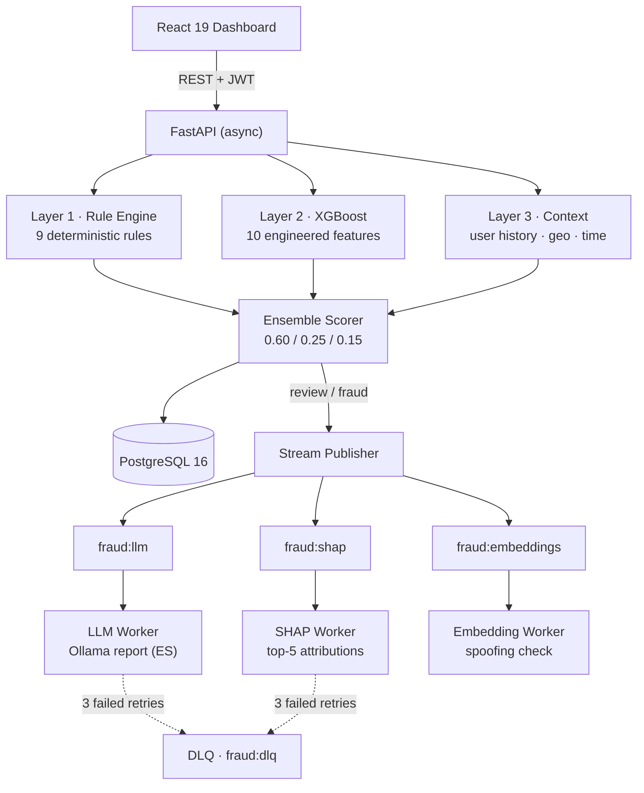

# 🛡️ Fraud Detector Hybrid

[](https://github.com/mikelrh-dev/fraud-detector/actions/workflows/ci.yml)

**English** | [Español](README.es.md)

Hybrid fraud detection system for financial transactions. A **deterministic rule engine** (9 rules), a **supervised ML model** (XGBoost, trained on PaySim) and a **local LLM** (Ollama) that writes explanatory reports for analysts — the LLM never decides, it only explains.

Every transaction gets a 0–100 risk score, a classification (`legitimate | review | fraud`), SHAP feature attributions, and — when flagged — an async LLM-generated technical report.

## Highlights

- **3-layer ensemble scoring**: rules 60% + ML 25% + context 15%, with dynamic fraud thresholds by amount tier
- **9 deterministic rules** covering amount, velocity, merchant risk, card mismatch, off-hours patterns, country mismatch and fraud-ring proximity
- **XGBoost** with 10 engineered features, graceful degradation (system works with `ml_score = 0` if no model is loaded)
- **SHAP explainability**: top-5 feature contributions persisted per transaction
- **Fraud ring detection**: directed graph (NetworkX), flags users within 2 hops of a known fraudster
- **Merchant spoofing detection**: sentence-transformers embeddings + cosine similarity (catches `AMAZ0N_STORE` → `Amazon`)
- **Redis Streams** with consumer groups, pending-message recovery (`XAUTOCLAIM`) and a dead-letter queue
- **Model monitoring**: Evidently data drift + custom PSI, automatic retraining triggers (F1 < 0.7 or drift > 30)
- **Immutable audit trail** with SHA-256 checksums on every scoring decision and analyst action
- **JWT auth** (access + refresh + blacklist), role-based access (user/admin), per-route rate limiting
- **React 19 dashboard** with score trends, SHAP cards and alert workflow
- **422 backend tests** (unit + integration), CI with 5 jobs (ruff, mypy, pytest, ESLint, vitest, Docker smoke build)

## Architecture



**Stack:** Python 3.11 · FastAPI · PostgreSQL 16 (asyncpg) · Redis 7 (Streams) · XGBoost · SHAP · NetworkX · sentence-transformers · Evidently · Ollama · React 19 + TypeScript + Vite + Tailwind 4 · Docker Compose (8 services)

## How a Transaction Is Scored

```
risk_score = 0.60 × rule_score + 0.25 × ml_score + 0.15 × context_score
```

Classification against a dynamic threshold that tightens for larger amounts:

| Amount tier | Fraud threshold |
|---|---|
| $0 – $1,000 | ≥ 70 |
| $1,001 – $10,000 | ≥ 50 |
| $10,001 – $50,000 | ≥ 45 |
| $50,001+ | ≥ 40 |

`review` band starts at 75% of the tier threshold. Everything below is `legitimate`.

### Layer 1 — Rule Engine (deterministic, capped at 100)

| Rule | Weight | Trigger |
|---|---|---|
| `high_amount` | 35 | amount > $1,000 |
| `velocity_burst` | 30 | > 1 txn in 5 min in a risky category |
| `high_velocity` | 25 | > 3 txns in 5 minutes |
| `off_hours_crypto` | 25 | night hours (0–6) + risky category |
| `unusual_merchant` | 20 | blacklisted merchant or risky category |
| `card_mismatch` | 20 | card not among the user's known cards |
| `country_mismatch` | 15 | txn country ≠ user home country |
| `near_fraud` | 15 | user ≤ 2 hops from a known fraudster (graph) |
| `unusual_hours` | 10 | txn between 00:00–06:00 |

Risky categories: `btc`, `crypto`, `gambling`, `casino`, `money_transfer`.

### Layer 2 — ML Model (XGBoost)

10 features: `amount`, `amount_vs_user_avg`, `amount_vs_user_std`, `tx_count_last_5min`, `tx_count_last_1h`, `hour_of_day`, `is_weekend`, `merchant_risk_level`, `is_crypto`, `amount_round_number`.

`predict_proba` is smoothed with a cubic curve and scaled to 0–100, so only confident predictions score high. If no model file is present, the API keeps working with `ml_score = 0`.

### Layer 3 — Context

User-level signals (historical averages, geography, time patterns) contribute the remaining 15%.

## Explainability, Monitoring & Audit

- **SHAP** (`TreeExplainer` over XGBoost): top-5 feature attributions computed async per scored transaction, rendered in the dashboard.
- **Drift detection**: Evidently `DataDriftPreset` (reference vs current distributions) plus a custom PSI implementation. `GET /api/v1/monitoring/drift`.
- **Retraining triggers**: fire when `F1 < 0.7` or `drift_score > 30` (checked in `MonitoringService`).
- **Audit trail**: every score, analyst review and LLM report is recorded with SHA-256 checksums. Analyst activity export is admin-only.

## Async Workers (Redis Streams)

| Stream | Consumer group | Worker | Output | Retry policy |
|---|---|---|---|---|
| `fraud:llm` | `llm-workers` | `llm_worker` | `LLMReport` row + audit entry | stays PENDING, max 3 |
| `fraud:shap` | `shap-workers` | `shap_worker` | `ShapAttribution` rows (top 5) | 3 retries → DLQ |
| `fraud:embeddings` | `embedding-workers` | `embedding_worker` | Redis result key (1h TTL) | ack on success, log on failure |

Streams are trimmed (`MAXLEN ~ 100,000`). The DLQ (`fraud:dlq`, capped at 10K) stores the original stream, consumer group and error reason. A recovery loop reclaims idle pending messages every 60s via `XAUTOCLAIM` (5-min idle timeout).

## Quick Start

### Docker (recommended)

```bash
git clone https://github.com/mikelrh-dev/fraud-detector.git
cd fraud-detector
cp .env.example .env

docker compose up -d                                # 8 services: postgres, redis, ollama, api, 3 workers, frontend
docker compose exec ollama ollama pull qwen2.5:0.5b # default LLM (configurable via OLLAMA_MODEL)
docker compose exec api python scripts/init_db.py   # create tables

# API docs:  http://localhost:8000/docs
# Frontend:  http://localhost:3000
```

Create your first user via the API:

```bash
curl -X POST http://localhost:8000/api/v1/auth/register \
  -H "Content-Type: application/json" \
  -d '{"email": "analyst@example.com", "password": "...", "full_name": "Analyst"}'
```

> `scripts/create_admin.py` prints a ready-to-run SQL `INSERT` if you prefer to seed an admin directly.

### Local development

```bash
# Backend
python -m venv venv && source venv/bin/activate   # Windows: venv\Scripts\activate
pip install -r requirements.txt

# Infrastructure only
docker compose up postgres redis ollama -d

python scripts/init_db.py
uvicorn src.api.main:app --reload

# Frontend (second terminal)
cd frontend && npm install && npm run dev
```

## Training the ML Model

The system runs without a model (`ml_score = 0`). To enable full detection:

```bash
python scripts/generate_synthetic_data.py     # 50k synthetic transactions (~5% fraud)
python scripts/train_xgboost_aligned.py       # → models/xgboost_paysim_v1.joblib
# restart the API to load the model
```

`train_xgboost_aligned.py` trains on the exact `FeatureEngine` features used in production. (`scripts/train_model.py` trains a legacy Isolation Forest — kept for reference, not used in the scoring path.)

## API Endpoints

### Auth
| Method | Path | Auth |
|---|---|---|
| POST | `/api/v1/auth/register` | public |
| POST | `/api/v1/auth/login` | public |
| POST | `/api/v1/auth/refresh` | refresh token |
| POST | `/api/v1/auth/logout` | user (blacklists token) |

### Transactions
| Method | Path | Auth |
|---|---|---|
| POST | `/api/v1/transactions` | user — create + full scoring pipeline |
| GET | `/api/v1/transactions` | user — list, filters, pagination |
| GET | `/api/v1/transactions/{id}` | user — detail + SHAP attributions |
| DELETE | `/api/v1/transactions/{id}` | **admin** — soft delete |
| GET | `/api/v1/transactions/graph/stats` | user — fraud network stats |
| GET | `/api/v1/transactions/{uid}/graph-features` | user — graph features per user |
| GET | `/api/v1/transactions/{id}/embedding` | user — merchant embedding analysis |

### Alerts
| Method | Path | Auth |
|---|---|---|
| GET | `/api/v1/alerts` | user |
| POST | `/api/v1/alerts/{id}/review` | user |
| POST | `/api/v1/alerts/{id}/false-positive` | user |
| POST | `/api/v1/alerts/{id}/revert` | user |

### Reports · Monitoring · Audit
| Method | Path | Auth |
|---|---|---|
| GET | `/api/v1/transactions/{id}/report` | user — LLM report (200 / 202 / 404) |
| GET | `/api/v1/monitoring/drift` | user — drift analysis |
| GET | `/api/v1/audit/transactions/{id}` | user — decision trail |
| GET | `/api/v1/audit/analysts/{uid}` | **admin** — analyst activity |
| POST | `/api/v1/audit/export` | **admin** — export by date range |

Health: `GET /health`, `GET /api/v1/health`, `GET /api/v1/status` (public).

**Rate limits:** login & register 10/min · transactions 100/min · alerts 60/min.

## Project Structure

```
fraud-detector/
├── src/
│   ├── api/                # FastAPI: main, rate_limit, v1/ (auth, transactions, alerts, reports, monitoring, audit)
│   ├── core/               # config, database, redis, security + stream_publisher / stream_manager / stream_dlq
│   ├── models/             # 10 SQLAlchemy models (transaction, user, fraud_score, fraud_alert, llm_report,
│   │                       #   ml_model_run, audit_entry, shap_attribution, rule_metadata, base)
│   ├── schemas/            # Pydantic v2 schemas
│   ├── services/           # rule_engine, feature_engine, ml_model, ensemble, shap_service,
│   │                       #   graph_service, merchant_embedding_service, velocity_store,
│   │                       #   llm, drift_service, monitoring, audit, transaction, auth
│   └── workers/            # llm_worker, shap_worker, embedding_worker (Redis Streams consumers)
├── frontend/               # React 19 + TS + Vite + Tailwind 4 (8 pages, 7 components, vitest + MSW)
├── tests/                  # unit + integration (422 backend tests)
├── scripts/                # init_db, create_admin, generate_synthetic_data, train_xgboost_aligned
├── notebooks/              # PaySim exploration / training notebooks
├── docker/                 # Dockerfiles (api, frontend) + nginx.conf
├── alembic/                # migrations
└── docker-compose.yml      # 8 services
```

## Testing

```bash
# Backend (422 tests)
pytest tests/ -v --cov=src --cov-report=term
pytest tests/unit -v            # unit only
pytest tests/integration -v     # integration only (needs postgres + redis)

# Frontend
cd frontend && npm test         # vitest
```

## CI/CD

GitHub Actions (`.github/workflows/ci.yml`), triggered on push/PR to `main`:

| Job | What it does |
|---|---|
| `backend-lint` | ruff + mypy |
| `backend-test` | pytest with PostgreSQL 16 + Redis 7 service containers |
| `frontend-lint-test` | ESLint + vitest |
| `frontend-build` | production build (after lint+test) |
| `docker-build` | Docker image smoke build (PRs only) |

## Environment Variables

See [.env.example](.env.example). Key settings (defaults from `src/core/config.py`):

```env
# Database
DB_USER=fraud
DB_PASSWORD=change_me_in_production
DB_NAME=fraud_detector
DB_HOST=localhost
DB_PORT=5432

# Redis
REDIS_URL=redis://localhost:6379/0

# Ollama
OLLAMA_HOST=http://localhost:11434
OLLAMA_MODEL=qwen2.5:0.5b        # any local tag works
OLLAMA_TIMEOUT=30

# JWT
JWT_SECRET_KEY=change-me-in-production
JWT_ALGORITHM=HS256
JWT_EXP_MINUTES=15

# Ensemble weights
ENSEMBLE_RULE_WEIGHT=0.60
ENSEMBLE_ML_WEIGHT=0.25
ENSEMBLE_CONTEXT_WEIGHT=0.15

# Feature flags
FRAUD_DETECTION_ENABLED=true     # false → scoring endpoints return 503
VELOCITY_STORE_ENABLED=true

# CORS
FRONTEND_URL=http://localhost:3000
```

## Design Decisions

**Why 3 layers?** Rules are fast, deterministic and explainable — they capture known fraud patterns. ML catches what rules can't express. Context adapts the score to each user's baseline. If one layer fails, the others still produce a score.

**Why doesn't the LLM decide?** LLMs are non-deterministic and can hallucinate. No fraud-blocking decision should depend on one. The LLM's job is strictly to *explain* an already-made decision to a human analyst — value without risk.

**Why XGBoost?** Supervised, fast on CPU, and its tree structure plugs directly into `TreeExplainer` for per-transaction SHAP attributions.

**Why Redis Streams (not just lists)?** Consumer groups give at-least-once delivery, pending-message recovery (`XAUTOCLAIM`) and a dead-letter queue — the difference between "usually works" and an auditable pipeline.

**Why soft delete?** Transactions are financial records. `DELETE` flags rows as deleted; history stays queryable for audit and retraining.

## License

MIT

## Author

Portfolio project by [mikelrh-dev](https://github.com/mikelrh-dev) demonstrating:

- Hybrid architecture: deterministic rules + ML + local LLM (with strict separation of decision vs explanation)
- ML in production: feature engineering aligned between training and serving, SHAP explainability, drift monitoring, retraining triggers
- Reliable async pipelines: Redis Streams, consumer groups, retries, DLQ
- Security: JWT with refresh + blacklist, RBAC, rate limiting, immutable SHA-256 audit trail
- Testing discipline: 422 backend tests + frontend vitest suite (164 tests), 5-job CI
