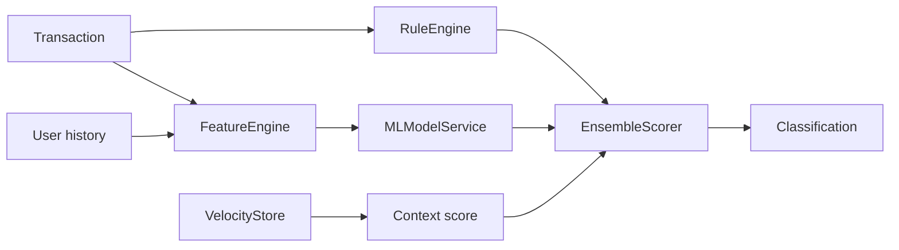

# Fraud Scoring Pipeline

## Definition

Pipeline que transforma una transacción y su contexto en scores individuales, score ensemble, threshold y clasificación.

## Key facts

`ScoringService` llama a `RuleEngine`, `FeatureEngine`, `MLModelService` y `EnsembleScorer`. El resultado es `ScoringResult`.

## Flow

## Interpretation

La composición permite explicar reglas, mantener ML opcional y aislar la lógica de negocio del endpoint.

## Practical application

[[entities/ml-feature-contract]], [[concepts/risk-classification]] y [[runbooks/end-to-end-debugging]].

## Uncertainty

La fórmula y los thresholds deben verificarse en `src/core/config.py` y `src/services/ensemble.py` para cada revisión.

## Related

- [[concepts/hybrid-fraud-detection]]
- [[tools/velocity-store]]
- [[tools/xgboost-serving]]
- [[synthesis/transaction-scoring-flow]]

## Sources

- `src/services/scoring_service.py`
- `src/services/ensemble.py`
