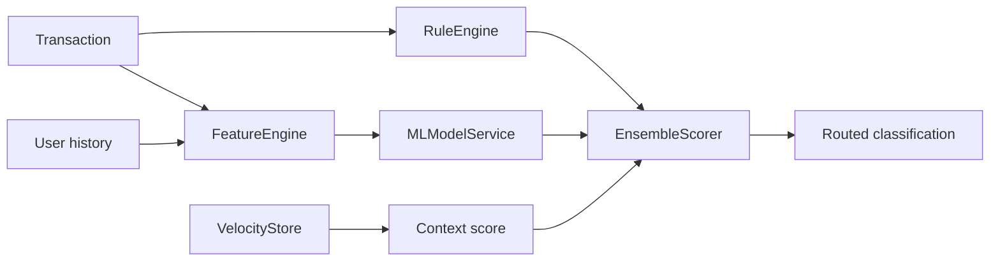

# Fraud Scoring Pipeline

## Definition

Pipeline que transforma una transacción y su contexto en scores individuales, score ensemble, threshold y clasificación.

## Key facts

`ScoringService` llama a `RuleEngine`, `FeatureEngine`, `MLModelService` y `EnsembleScorer`. El resultado es `ScoringResult`.

## Flow



La clasificación se decide sobre las capas, no sobre `ensemble_score`:

```
fraud      : ml_score > threshold, OR (rule_score > threshold AND amount >= CRITICAL_FLOOR
                                      AND ml_score >= ML_FLOOR)
review     : not fraud, and (rule_score > threshold OR ml_score > threshold * 0.75)
legitimate : otherwise
```

`CRITICAL_FLOOR` es el `min_amount` del último tier (`critical`) de
`settings.threshold_tiers`, leído de la configuración en `src/services/scoring_service.py`
(`_meets_critical_floor`) y no repetido como constante. `ensemble_score` se sigue calculando y
persistiendo con `EnsembleScorer.combine`, pero ya no decide. Ver
[[concepts/risk-classification]].

`ML_FLOOR` es el suelo de acuerdo del modelo (`settings.ml_floor`, leído por `_ml_floor()`) y es
la **tercera** condición de la rama de reglas, junto al importe. Sin ella esa rama puede bloquear
por la autoridad de las reglas sola sobre una transacción que el modelo considera ordinaria. No es
una barra de confianza sino de "el modelo ha opinionado": un 5 sobre 100 es una señal débil y
suficiente, y por debajo de ese valor el modelo está diciendo que no encontró nada. Asimetría
deliberada: el suelo gatea **solo** la rama de reglas, porque `ml_score > threshold` sin más sigue
bloqueando — eso es el modelo desautorizando a las reglas.

Estas bandas requieren ambas capas. Si el modelo no está cargado no hay capa ML contra la que
enrutar, así que una transacción degradada vuelve a las bandas de `ensemble_score`
(`combine` redistribuyendo los pesos entre las capas que sí produjeron valor, y después
`EnsembleScorer.classify`). La clasificación en modo degradado no cambia.

## Interpretation

La composición permite explicar reglas, mantener ML opcional y aislar la lógica de negocio del endpoint.

## Practical application

[[entities/ml-feature-contract]], [[concepts/risk-classification]] y [[runbooks/end-to-end-debugging]].

## Uncertainty

La fórmula y los thresholds deben verificarse en `src/core/config.py` y `src/services/ensemble.py` para cada revisión.

## Related

- [[concepts/hybrid-fraud-detection]]
- [[tools/velocity-store]]
- [[tools/xgboost-serving]]
- [[synthesis/transaction-scoring-flow]]

## Sources

- `src/services/scoring_service.py`
- `src/services/ensemble.py`
