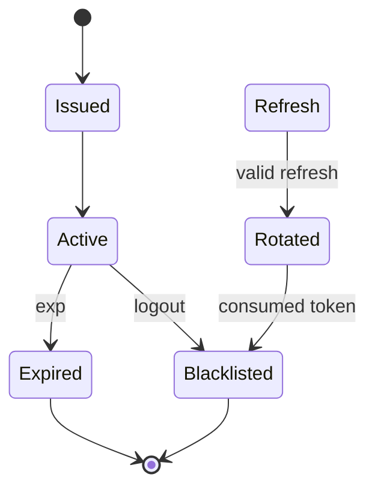

# JWT Session Lifecycle

## Definition

Access/refresh tokens JWT con tipos explícitos, JTI y revocación en Redis.

## Key facts

- access usa `typ=access` y dura por defecto 15 minutos;
- refresh usa `typ=refresh` y dura por defecto 24 horas;
- cada token tiene `jti` único;
- refresh rotation revoca el token consumido;
- logout añade tokens a blacklist con TTL.

## Flow

## Interpretation

Separar tipos evita usar un access token como refresh y permite revocación individual.

## Practical application

[[tools/fraud-detector-api-contract]] y [[runbooks/troubleshooting]].

## Uncertainty

El frontend actual redirige ante `401`, pero su interceptor Axios no implementa refresh automático.

## Related

- [[projects/fraud-detector]]
- [[concepts/immutable-audit-trail]]
- [[codebases/fraud-detector-backend]]

## Sources

- `src/core/security.py`
- `src/core/dependencies.py`
- `src/api/v1/auth.py`
