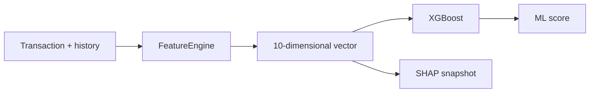

# ML Feature Contract

## Definition

Vector NumPy de 10 posiciones producido por `FeatureEngine` y consumido por ML/SHAP.

## Key facts

```text
0 amount
1 amount_vs_user_avg
2 amount_vs_user_std
3 tx_count_last_5min
4 tx_count_last_1h
5 hour_of_day
6 is_weekend
7 merchant_risk_level
8 is_crypto
9 amount_round_number
```

El orden, dimensión y normalización de categorías forman parte del contrato.

## Flow



## Interpretation

Una modificación de posición o significado requiere revalidar el artefacto y las atribuciones SHAP.

## Practical application

[[tools/xgboost-serving]], [[concepts/fraud-explainability]] y [[runbooks/testing-and-ci]].

## Uncertainty

Artefactos legacy pueden carecer de `feature_names`; el modelo actual puede incluir el contrato estampado.

## Related

- [[concepts/fraud-scoring-pipeline]]
- [[entities/redis-event-contracts]]
- [[entities/model-monitoring-contract]]

## Sources

- `src/services/feature_engine.py`
- `src/services/ml_model.py`
- `src/core/ml_constants.py`
