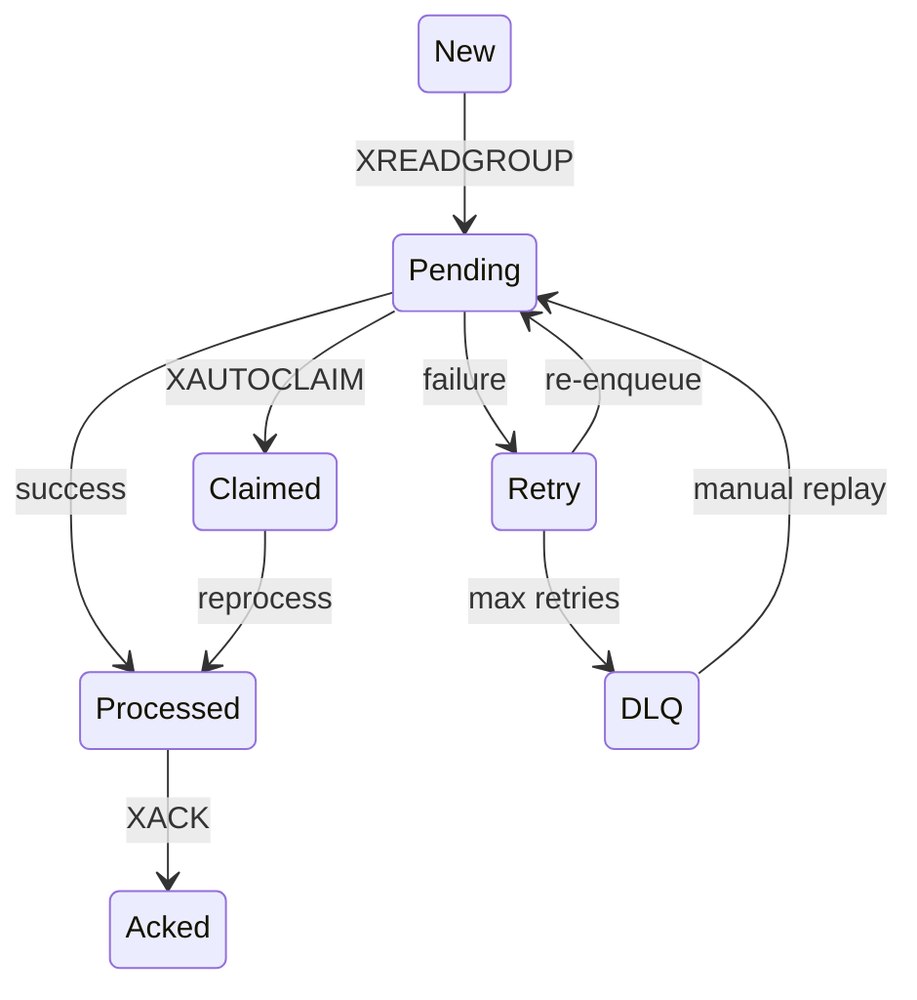

# Worker Recovery

## Definition

Procedimiento para diagnosticar y recuperar procesamiento Redis Streams.

## Key facts

Workers: LLM (`fraud:llm`), SHAP (`fraud:shap`) y embeddings (`fraud:embeddings`). Usan grupos, PEL, `XREADGROUP`, `XACK`, `XAUTOCLAIM` y retries; los fallos agotados llegan a `fraud:dlq`.

## Flow



## Practical application

```bash
docker compose ps
docker compose logs --tail=200 worker
docker compose logs --tail=200 shap-worker
docker compose logs --tail=200 embedding-worker
redis-cli XPENDING fraud:llm llm-workers
redis-cli XPENDING fraud:shap shap-workers
redis-cli XPENDING fraud:embeddings embedding-workers
redis-cli XRANGE fraud:dlq - + COUNT 20
```

Revisar `XINFO GROUPS` y `XINFO CONSUMERS` cuando pending crezca. Los mensajes idle más de cinco minutos pueden ser reclamados.

## Failure modes

- stream creciendo: consumer lento o caído;
- pending creciendo: mensajes sin ACK;
- DLQ: retries agotados;
- grupo ausente: startup fallido o Redis inaccesible.

## Uncertainty

Backoff y semántica exacta de retry deben comprobarse por worker; LLM y SHAP tienen retry/DLQ explícitos y embeddings tiene recuperación de pendientes.

## Related

- [[tools/redis-streams]]
- [[concepts/at-least-once-processing]]
- [[runbooks/end-to-end-debugging]]

## Sources

- `src/workers/`
- `src/core/stream_dlq.py`
- `docker-compose.yml`
