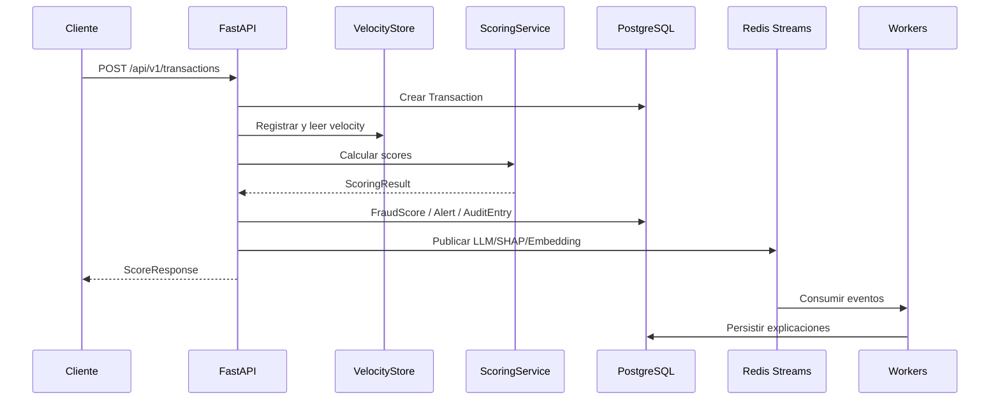

# Transaction Scoring Flow

## Definition

Síntesis del recorrido desde la petición HTTP hasta los outputs persistentes y asíncronos.

## Key facts

```text
request
  → auth/validation
  → Transaction
  → VelocityStore/history/graph
  → ScoringService
  → FraudScore
  → Alert/status/audit
  → Redis events
  → workers
```

## Flow



## Interpretation

La respuesta API contiene la decisión; los workers producen explicaciones y enriquecimientos posteriores.

## Practical application

Para detalle de cada contrato, consultar [[tools/fraud-detector-api-contract]], [[entities/ml-feature-contract]], [[entities/redis-event-contracts]] y [[runbooks/end-to-end-debugging]].

## Uncertainty

La disponibilidad de reportes, SHAP y embeddings es eventual. Un resultado pending no implica fallo de scoring.

## Related

- [[concepts/fraud-scoring-pipeline]]
- [[concepts/fraud-explainability]]
- [[entities/fraud-detector-domain-model]]
- [[projects/fraud-detector]]

## Sources

- `src/api/v1/transactions.py`
- `src/services/scoring_service.py`
- `src/core/stream_publisher.py`
- `src/models/`
