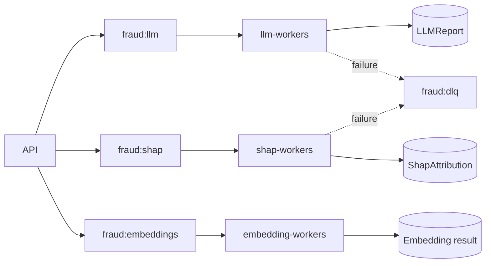

# Redis Streams

## Context

Infraestructura de eventos con consumer groups para desacoplar scoring de enriquecimientos.

## Key facts

Streams: `fraud:llm`, `fraud:shap`, `fraud:embeddings`, `fraud:dlq`. El publisher usa `XADD`, trim aproximado hasta 100.000 eventos y timestamp de publicación.

## Flow

## Interfaces

Los workers usan `XGROUP CREATE` con `MKSTREAM`, `XREADGROUP`, `XACK` y `XAUTOCLAIM`.

## Interpretation

La semántica es at-least-once; los mensajes pueden reentregarse.

## Practical application

[[entities/redis-event-contracts]], [[runbooks/worker-recovery]] y [[concepts/at-least-once-processing]].

## Uncertainty

La política de retry puede variar por worker; revisar cada implementación.

## Related

- [[tools/velocity-store]]
- [[concepts/scoring-degradation]]
- [[concepts/at-least-once-processing]]

## Sources

- `src/core/stream_publisher.py`
- `src/core/stream_manager.py`
- `src/core/stream_dlq.py`
- `src/workers/`
